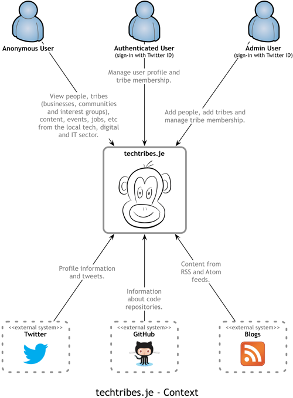

techtribes.je
=============

This repo contains all of the source code for the [techtribes.je](http://techtribes.je) website - the only way to keep up to date with the IT, tech and digital sector in Jersey and Guernsey, Channel Islands.

techtribes.je is built using Java, Spring (core, MVC, Social), Apache Lucene, MySQL, MongoDB, twitter4j, ROME and more. It all runs on Apache Tomcat in the cloud at Rackspace.

## Prerequisites

You'll need the following in order to build and run the techtribes.je website:

- [Java 7](http://www.oracle.com/technetwork/java/javase/downloads/index.html)
- [Apache Ant 1.9](http://ant.apache.org)
- [Apache Tomcat 7](http://tomcat.apache.org)
- [MySQL 5.5](http://www.mysql.com)
- [MongoDB 2.4](http://www.mongodb.org)

## Software Guidebook

The [Software Guidebook can be found on Leanpub](https://leanpub.com/techtribesje).

