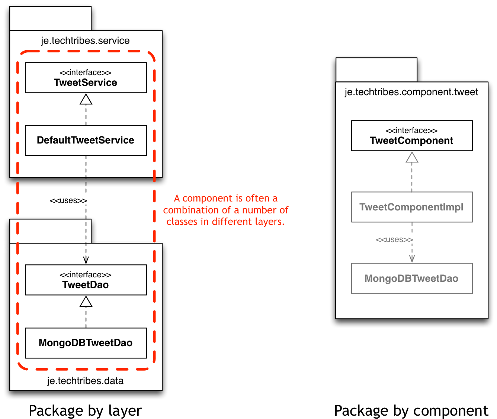

This section provides information about the principles adopted for the development of the techtribes.je website.

## Package by component

To provide a simple mapping of the software architecture into the code, the package structure of the code reflects a "package by component" convention rather than "package by layer".

This means that the codebase is broken up into a number of components, each of which has:

 - A well-defined public interface.
 - Strong encapsulation (i.e. all implementation details are package protected where possible).
 - A Spring configuration file called component.xml to configure and wire the component together into the rest of the system.
 
## Automated testing
 
The strategy for automated testing is to use automated unit and component tests.
 
 - __Unit tests__: These are fast running, very small tests that operate on a single class or method in isolation. See the [techtribes-core unit tests](https://github.com/techtribesje/techtribesje/tree/master/techtribes-core/test/unit) for some examples. 
 - __Component tests__: Rather than mocking out database connections to test component internals, components are tested as single units to avoid breaking encapsulation. See the [techtribes-core component tests](https://github.com/techtribesje/techtribesje/tree/master/techtribes-core/test/component) for some examples.

## Configuration

All configuration needed by components is externalised into a Java .properties file, which is held outside of the deployment files created by the build process. This means that builds can be migrated from development, testing and into production without change.

## Spring Autowiring

Spring autowiring is only used in the web-tier part of techtribes.je ([techtribes-web](https://github.com/techtribesje/techtribesje/tree/master/techtribes-web)), to inject components into the Spring MVC controllers.
